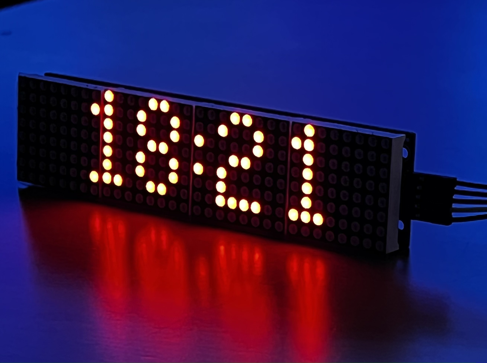

# A clock

This is an over-complicated ESP32 clock. 

<p align="left">
  
</p>

## Hardware

Connect the MAX7219 LED dot display to the ESP32 DEVKIT V1 DOIT as follows:

```
MAX7219 <-> ESP32
-----------------
 DIN        D23
 CS         D15
 CLK        D18
 VCC        5V
 GND        GND
```

Optional: BME280 temperate/humidity/pressure sensor.

Parts:
 * https://a.co/d/dqPsLlN
 * https://a.co/d/hsmKt0U

## One-time: install toolchain

Follow https://docs.espressif.com/projects/esp-idf/en/stable/esp32/get-started/index.html#step-2-get-esp-idf

```
mkdir -p ~/esp
cd ~/esp
git clone -b v4.4.1 --recursive https://github.com/espressif/esp-idf.git
cd esp-idf
virtualenv venv --system-site-packages
source venv/bin/activate
./install.sh  # will install stuff to ~/.espressif
. ./export.sh # may error out, keep going

esptool.py version # check it's sane


```

## One-time: clone this repo

```
git clone https://github.com/OnlyRubyFans/overclock
git submodule update --init --recursive

```

## One-time: burn bootloader

```
cd path/to/project/source/clock
make menuconfig
# set "Serial flasher config" > "Default serial port" to /dev/cu.SLAB_USBtoUART or /dev/tty.SLAB_USBtoUART , whatever you see in your system

make erase_flash
make bootloader-flash
make partition_table-flash
```


## One time: provision wifi credentials

Delete the `build/` directory before proceeding if it's still there.

```
make menuconfig
# add credentials (SSID/pass) in "Example Connection Configuration"
# also: uncheck "Obtain IPv6 address"
rm -rf build # otherwise your changes won't get picked up
make erase_flash
make bootloader-flash
make partition_table-flash
make && make app-flash && make monitor
```


## Every time: set up your env

```
export IDF_PATH=~/esp/esp-idf
source $IDF_PATH/venv/bin/activate
pushd $IDF_PATH && ./install.sh && . ./export.sh ; popd
```

## Build & upload

```
make && make app-flash && make monitor
make monitor # exit with Ctrl + ]
```


## TODO

- [ ] kerning
- [ ] fw update
- [ ] time consensus based on interval intersection
- [ ] fall back to NTP?
- [ ] better story for provisioning secrets
- [ ] better story for configuration?
- [ ] ...
